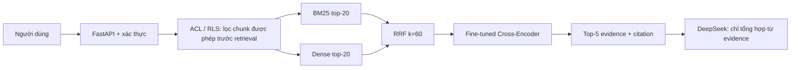
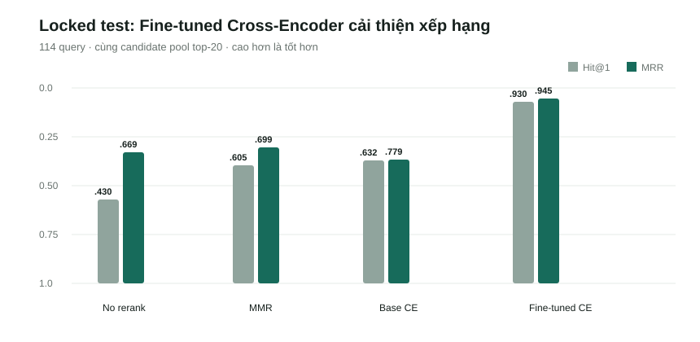

# KnowledgeOS v1.0.2 — Technical & Defense Brief

## 1. Một câu để mở đầu

KnowledgeOS là MVP quản trị tri thức nội bộ tiếng Việt: người dùng chỉ truy vấn các đoạn tài liệu mà quyền của họ cho phép; hệ thống xếp hạng evidence rồi trả lời có trích dẫn nguồn.

## 2. Luồng kỹ thuật cần nhớ

- **Local/offline research:** split, benchmark, fine-tune, checkpoint checksum và test. Không có API LLM bắt buộc.
- **Web demo:** FastAPI, Supabase Auth/RLS/Storage, parser file và DeepSeek API (nếu cấu hình). API key chỉ nằm ở biến môi trường server.
- **Fine-tune:** `cross-encoder/mmarco-mMiniLMv2-L12-H384-v1`, 2 epoch, batch 2, gradient accumulation 8, learning rate `2e-5`, max length 256, seed 42, CUDA/FP16. Checkpoint SHA-256: `3782daf…aa44`.
- **Runtime an toàn:** mặc định là ACL-first BM25. Hybrid + fine-tuned reranker chỉ bật khi checkpoint đã xác thực và dependency có mặt; nếu lỗi thì fallback BM25.
- **Checkpoint local:** biến môi trường `WEBAPP_RERANKER_CHECKPOINT_PATH` trỏ đến checkpoint đã bàn giao ngoài Git; `WEBAPP_RERANKER_CHECKSUM_PATH` trỏ tới file checksum. `/api/health` chỉ báo reranker enabled sau khi checksum đã qua.

## 3. Đo lường locked test set

| Phương án | Hit@1 | Hit@5 | MRR | nDCG@10 | p50 / p95 |
|---|---:|---:|---:|---:|---:|
| BM25 | 0.439 | 0.974 | 0.660 | 0.740 | 57 / 112 ms |
| Dense | 0.605 | 0.947 | 0.750 | 0.805 | 29 / 37 ms |
| Hybrid RRF | 0.430 | 0.965 | 0.669 | 0.748 | 86 / 147 ms |
| Base Cross-Encoder | 0.632 | 0.956 | 0.779 | 0.834 | 119 / 150 ms |
| **Fine-tuned Cross-Encoder** | **0.930** | **0.974** | **0.945** | **0.955** | **121 / 143 ms** |

**Ý nghĩa:** Hybrid không thắng Dense ở Hit@1; lợi ích của Hybrid là giữ Recall@20 = 1.0, tạo candidate pool ổn định. Bước tạo khác biệt lớn là fine-tuned Cross-Encoder: cùng candidate pool, Hit@1 tăng `0.632 → 0.930` và MRR tăng `0.779 → 0.945` so với base model.

Paired bootstrap 5,000 lần trên 114 query cho fine-tuned trừ base: Delta Hit@1 `+0.298`, CI95% `[0.219, 0.386]`; Delta MRR@5 `+0.168`, CI95% `[0.119, 0.218]`. CI không chứa 0, nên cải thiện xếp hạng có bằng chứng trên locked split này.

## 4. Thiết kế thực nghiệm

- Corpus: 4,641 passages; split query-generalization cùng corpus, seed 42.
- Split: train/dev/test = `913 / 114 / 114`.
- Leakage contract: không trùng normalized question hay pair giữa split; passage cùng corpus có thể xuất hiện ở nhiều query theo thiết kế.
- Checkpoint chọn theo validation MRR@5; validation đã bão hòa 1.0 ở epoch 1 và 2, nên chọn epoch 1. Loss train giảm `0.0323 → 0.00835`.

## 5. Cách trả lời hội đồng

**Vì sao không chỉ BM25?** BM25 tốt với từ khóa chính xác, Dense tốt với tương đồng ngữ nghĩa; RRF hợp hai ranking mà không ép hai thang điểm về cùng đơn vị.

**Fine-tune cái gì?** Fine-tune Cross-Encoder reranker, không fine-tune BM25. Mô hình nhận cặp `(câu hỏi, đoạn tài liệu)` rồi học chấm đoạn nào phù hợp hơn; nó chỉ rerank top-20 nên chi phí hợp lý.

**Khác với baseline ở đâu?** Baseline BM25/Dense trả candidate. Bản đề xuất giữ ACL trước retrieval, fusion RRF và dùng fine-tuned Cross-Encoder chọn top-5 evidence trước khi gọi LLM.

**Giới hạn cần nói thật:** đây là offline same-corpus evaluation; chưa chứng minh document-generalization, RAGAS, tải 20 user hay production readiness. Render mặc định chưa được phép claim đang chạy Hybrid/FT CE nếu image chưa đóng gói checkpoint và dependency.

## 6. Release gate v1.0.2

Trước demo phải có: (1) smoke ACL khác phòng ban, (2) upload file thật, (3) câu trả lời có citation, (4) checkpoint + checksum + reranker trace trên môi trường demo, (5) commit/release Render được xác minh.
